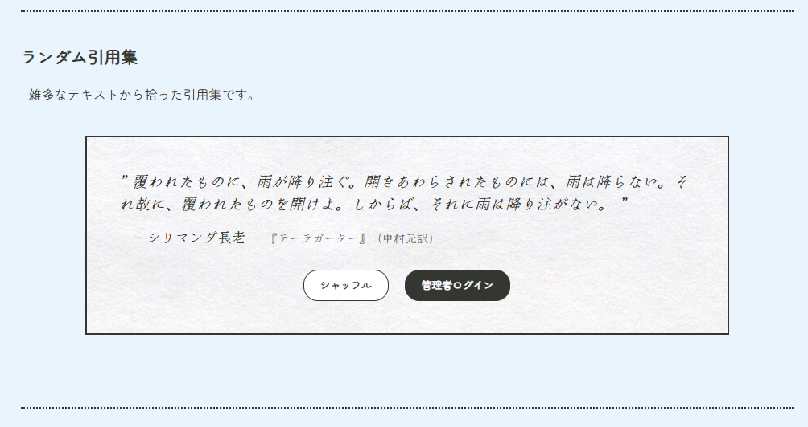
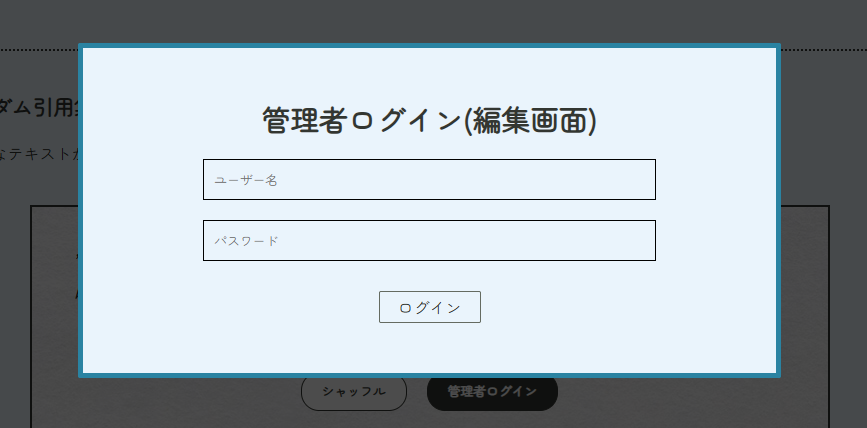
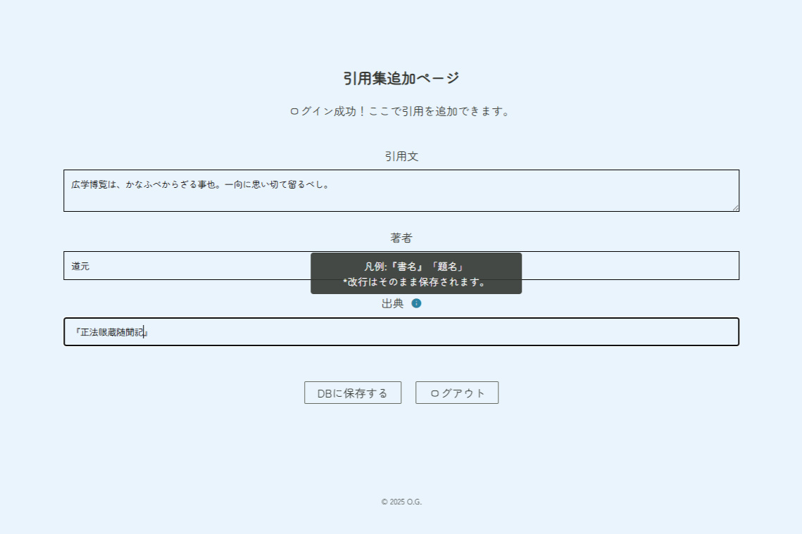
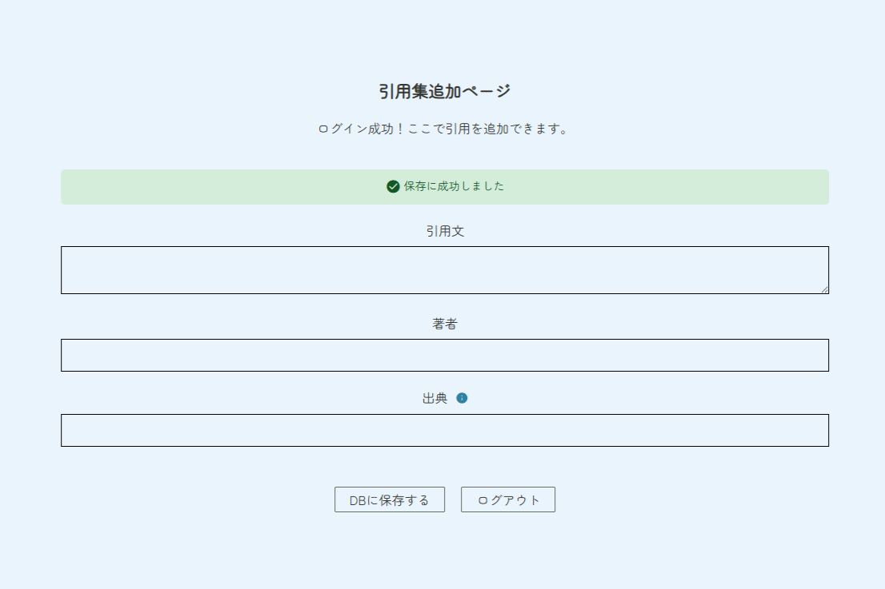
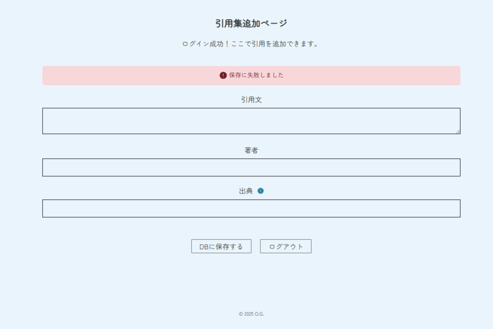

# OG Portfolio

## 概要
これまでのプログラミング学習のまとめとして作成したポートフォリオサイトです。主なコンテンツとして、Blenderで作成した3DモデルやJSON、Reactを活用した機能を掲載しています。

## URL
※現時点ではローカル環境での確認を想定しています。

## 構成
```text
├─audio                     *音声アセット
├─img                       *画像アセット
├─react-timer               *React編集用ソース           
├─v3-timer                  *JSON版ランダム引用集 + 30分タイマー
└─v4-php                    *php + MySQL版（簡易CMS）
  └── database-sample.php   *DB設定サンプル（本体はパスワードを含むためgitignore）
```

## php版サンプル画面
### 1. 概要
文章からの引用を「本文」「著者」「出典」の3項目でランダムに表示する機能です。phpを使ってデータベースに文章を追加する簡易CMS（セッション管理、パスワードハッシュ化対応）を作成しました。現時点ではローカル環境 + xamppで開発中ですので、下記に操作画面を掲載します。

### 2. 引用集
データベースからランダムに取得したコンテンツを表示します(※v3ではJSONから取得)。「シャッフル」ボタンを押すと内容が更新されます。


### 3. 編集画面
「管理者ログイン」ボタンを押すとログイン用モーダルが表示されます。ログインに成功すると、編集画面に遷移します。ここでテキストを入力します。




### 4. 結果通知
無事追加されると編集画面に戻り結果が表示されます。なんらかのエラーが出ると赤く表示されます。



## 使用技術
- HTML5
- CSS3
- JavaScript (ES6)
- React.js
- php + MySQL (xampp)

## 制作方針
作者の現時点でのプログラミングスキルの目安となるようなサイトとして作成しました。そのため、原理や構文の理解が十分でない要素は採用しないよう心掛けました。phpおよびデータベースに関してはAI（ChatGPT、Gemini）を活用し、発展的な記法なども一つ一つ理解しながら想定した動作の実現を目指しました。

## 工夫した点
- セマンティックHTMLを意識した構造
- レスポンシブ対応（PC、モバイル）
- id・クラス立ての統一性、コード自体の可読性
- 将来のコンテンツ追加のしやすさ

## 苦労した点
- margin / paddingやflexの性質を見直し余白設計のムダ・重複をなくすこと
- 実現したい挙動をできる限り現在のスキルの範囲内で実装すること
- react、phpなどを用い後から機能を追加したことで全体的な制御・管理が難しくなってきた

## 今後の挑戦
- 3Dモデルや、観光地で撮影した360°画像をVRビューワなどで埋め込みたい
- モバイル表示時にハンバーガーメニューを使いたい
- Reactのより深い理解と応用
- モバイル環境での通知の有効化